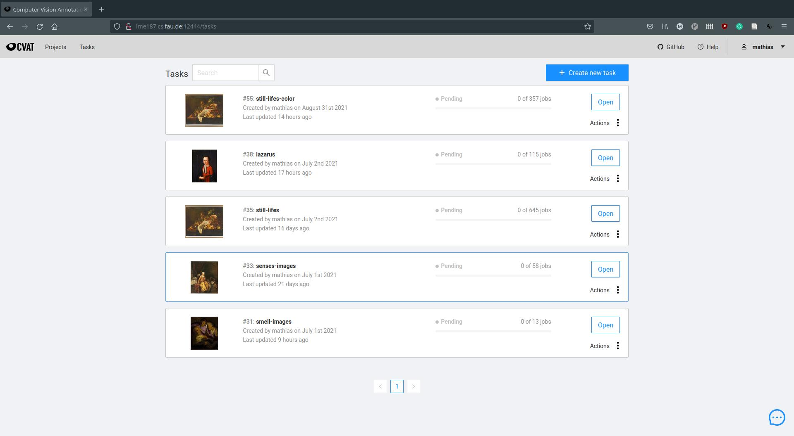
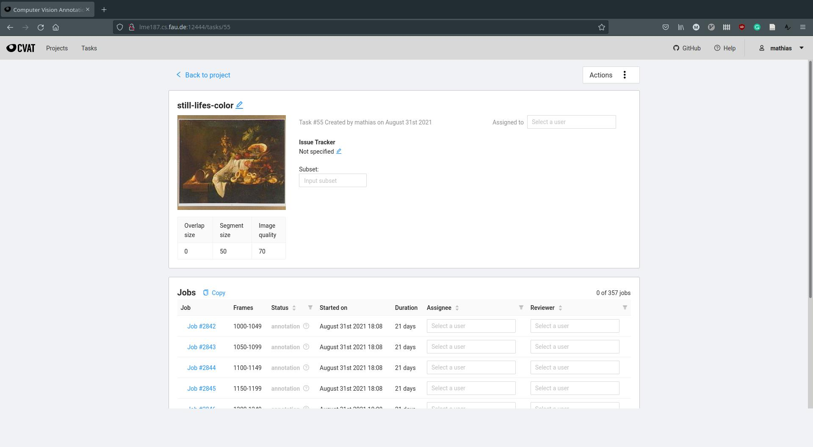
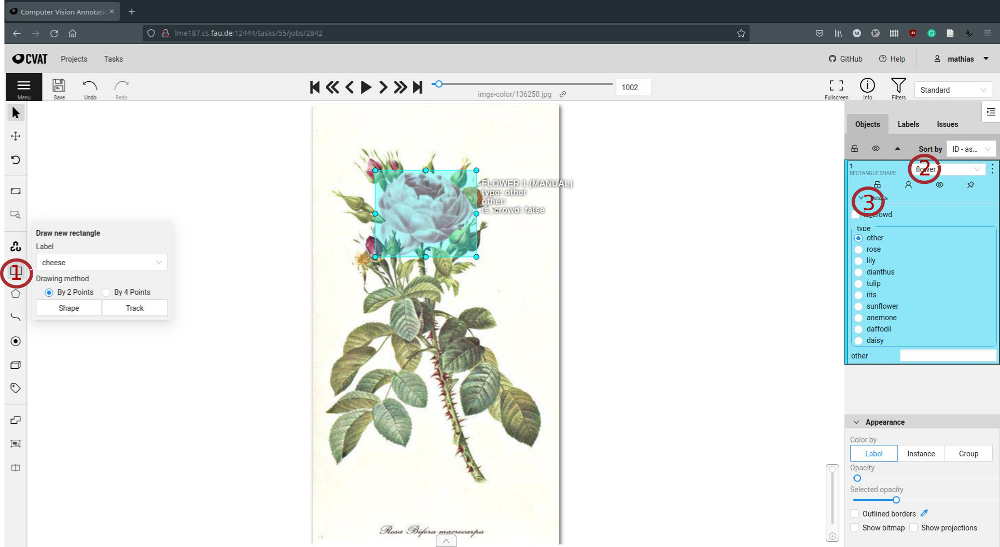

# Annotation Guidelines
These are the guidelines for the annotation of olfactory references in historic artworks. 

## Basics
- We use [CVAT](https://github.com/openvinotoolkit/cvat) as image annotation tool. An instance is accessible via http://lme187.cs.fau.de:12444. 
- There is an extensive [manual](https://openvinotoolkit.github.io/cvat/docs/manual/) available at their github page.
- In order to create annotations, you need to be registered as a user. You can create one yourself or notify us, so we do it for you (preferred). 
- There is a slack channel `wp2-annotations` where we discuss annotation related issues. Please notify us if you would like to be added to the channel.

### Task Overview
- Once logged in, you will be taken to the task overview. The artworks are ordered thematically, depending on the query keywords that was used in image retrieval.
- Select one of the tasks according to your interest and the project need, by clicking on the `open` button. Our current annotation focus is `still-lifes-color`. 

### Job Overview
- Each tasks consists of multiple jobs, each containing 50 artworks to be annotated. Select one job by clicking on the job name (e.g. `job #2842`) to start annotating. 
- Please mark that you are working on the job by entering your username in the `assignee` field on the right. 
- Of course, it is possible (and encouraged) to review other users' jobs and share your thoughts on the slack channel or in the repository issues. 

### Annotation Window
- Having selected a job, you will see the first artwork that is waiting to be annotated. Create your first box by clicking on the empty rectangle on the left (`1`) or by pushing the `n` button on the keyboard. 
- After creating the box, you can select a category for the box in the object tab on the right (`2`), by clicking on the `details` button (`3`) you can choose a subcategory. If no suitable subcategory is listed (and you think the subcategory is important as far as smell is concerned), you can enter a free text in the `other` field.

## Categories

## Hotkeys Cheatsheet

## Attribute Annotation Mode

