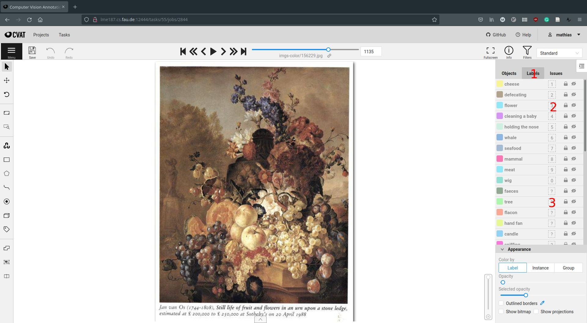
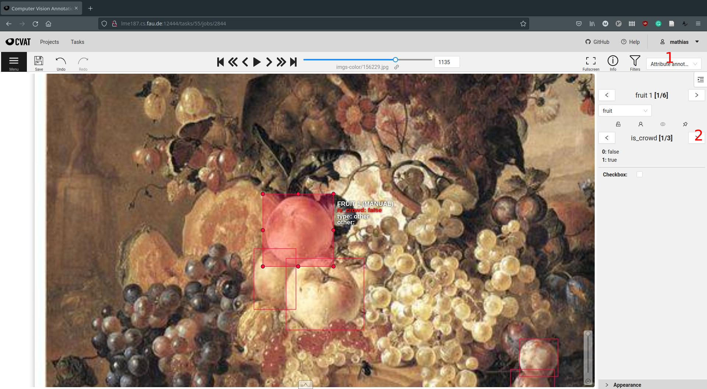
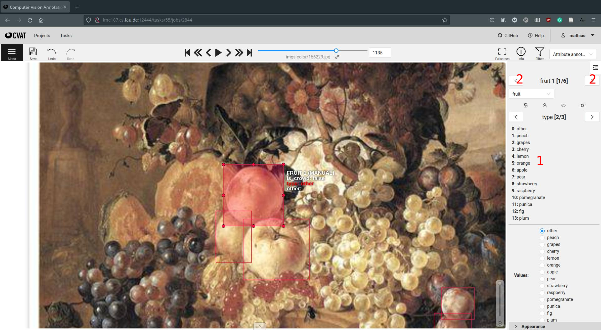

# Annotation Guidelines
These are the guidelines for the annotation of olfactory references in historic artworks. 

## Basics
- We use [CVAT](https://github.com/openvinotoolkit/cvat) as image annotation tool. An instance is accessible via http://lme187.cs.fau.de:12444. 
- There is an extensive [manual](https://openvinotoolkit.github.io/cvat/docs/manual/) available at their github page.
- In order to create annotations, you need to be registered as a user. You can create one yourself or notify us, so we do it for you (preferred). 
- There is a slack channel `wp2-annotations` where we discuss annotation related issues. Please notify us if you would like to be added to the channel.

### Task Overview
- Once logged in, you will be taken to the task overview. The artworks are ordered thematically, depending on the query keywords that was used in image retrieval.
- Select one of the tasks according to your interest and the project need, by clicking on the `open` button. Our current annotation focus is `still-lifes-color`. 

### Job Overview
- Please mark that you are working on the job by entering your username in the `assignee` field on the right. 
- Each tasks consists of multiple jobs, each containing 50 artworks to be annotated. Select one job by clicking on the job name (e.g. `job #2842`) to start annotating. 
- Of course, it is possible (and encouraged) to review other users' jobs and share your thoughts on the slack channel or in the repository issues. 

### Annotation Window
- Having selected a job, you will see the first artwork that is waiting to be annotated. 
- You can navigate between artworks using the arrows on the top of the screen or by pushing the `f` and `n` buttons on the keyboard.
- Create your first box by clicking on the empty rectangle on the left (`1`) or by pushing the `n` button on the keyboard. 
- After creating the box, you can select a category for the box in the object tab on the right (`2`), by clicking on the `details` button (`3`) you can choose a subcategory. If no suitable subcategory is listed (and you think the subcategory is important as far as smell is concerned), you can enter a free text in the `other` field.
- For the annotations to be persisted, they must be saved using the `save` button in the top left corner, or by pushing `ctrl+s` on the keyboard. It is advisable to quicksave from time to time, so the annotations do not get lost if you accidentally close the browser.

### Category Selection
- If there are many boxes of the same category to label, selecting a default label can speed up the process a lot.
- To do so, click on the `label` tab (`1`) on the right. 
- There you see all available high level categories. Some of them have numbers next to them (`2`).
- Push `ctrl + n` on the keyboard to select the category with number `n` next to it as default label for new bounding boxes, e.g. pushing `ctrl + 3` would select flower as the default label. 
- Since there are more than 10 possible categories, some of the categories do not have a number next to them but a `?` (`3`).
- To be able to select them as default category, a number has to be assigned first. To do so, simply click on the `?` (`3`), you can then select one number that should be replaced with the current category.

### Attribute Annotation
- In cases where many subcategories need to be selected, the attribute annotation mode can speed up the annotation. Select the attribute annotation mode by clicking on the dropdown menu in the top right corner of the screen (`1`).
- Now navigate through the attributes on the right until you see the `type` selection (`2`).

- You can now conveniently select the appropriate subcategory by hitting the number key on the keyboard that is next the subcategory (`1`).
- Unfortunately, there is no shortcut for selecting subcategories with numbers higher than 10. In these cases, the type can be chosen by selecting it with the mouse in the list below.
- Navigate through the objects using the arrow buttons above (`2`) or by pushing `tab`/`shift+tab` on the keyboard.

## Categories
- To limit the number of labels to choose from, the categories are ordered in a two level hierarchy where most categories contain a number of subcategories to further specify the annotation.
- A visualization of the hierarchy is available [here](labelsystem.jpg) 
- Apart from the predefined subcategories, each category has a generic `other` free text field where missing subcategories can be entered. 
- Furthermore, there is a specific `other` category that is meant to capture missing categories that the annotator thinks is important. It has a `type` free text field where the name of the missing category can be entered.
- Note that the annotation categories and their hierarchy do not match the way they are entered into the knowledge graph. There will be a separate mapping step before integrating the annotations there.
- If there is something you are absolutely missing from a nose-first perspective or you think is superfluous, please let us know, either in the issues, or in the slack channel.

## Best Practices

### Artwork Skipping 
- We are training the object detectors in an iterative process. In a first step, we want to train them using artworks that are as close as possible to photographic depictions. Then, in a second step, we will try to increase the level of artistic abstraction and expand our dataset to artworks that deviate more and more from photorealistic paintings. 
- This entails that grayscale images and images with a high level of abstraction should be skipped in the first round of annotations. Please just proceed to the next image if you encounter artworks where the objects are very hard to recognize (for you, as a human annotator).

### Subcategory Specification
- In the current stage of project we are not using the subcategories of many categories (e.g. flower or bird subcategories are not used). Other subcategories such as Mammal -> Dog are already used. 
- However, some of the subcategories may carry a lot of olfactory meaning (e.g. specific kinds of flowers), so be as specific as possible when defining the subcategory. 

### Instance Annotation
- In many artworks, objects are grouped together very closely with a lot of occlusion. Although it is hard to label each of these objects indidually, we currently do not have a way of handling crowd annotations. So, if possible, please try to label each instance separately. Zooming in and using the hotkeys `n` + default category can make this a little more convenient. 
- For cases where instance labeling is not possible, added the is_crowd attribute (based on the [coco iscrowd attribute](https://towardsdatascience.com/coco-data-format-for-object-detection-a4c5eaf518c5)) which can be checked in these cases. However, since we do not have a way of handling crowd references, try to avoid using this option.

## Hotkeys Cheatsheet
TBD

## Specific Category Guidelines

### Flower
- We define one instance of a flower as a visible blossom. Closed buds, leafs, and stems are not considered to be part of the flower instance.

### Fruit
- Grapes: One instance of an grapes-object is not a single berry, but the whole bunch of berries

### Sniffing
- Please include the face (i.e. eyes, ears, nose) and the hand holding the object in the bounding box

### Smoking Equipment 

